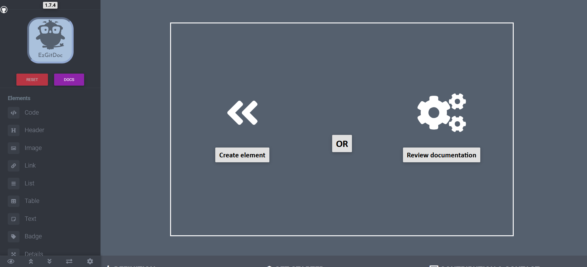
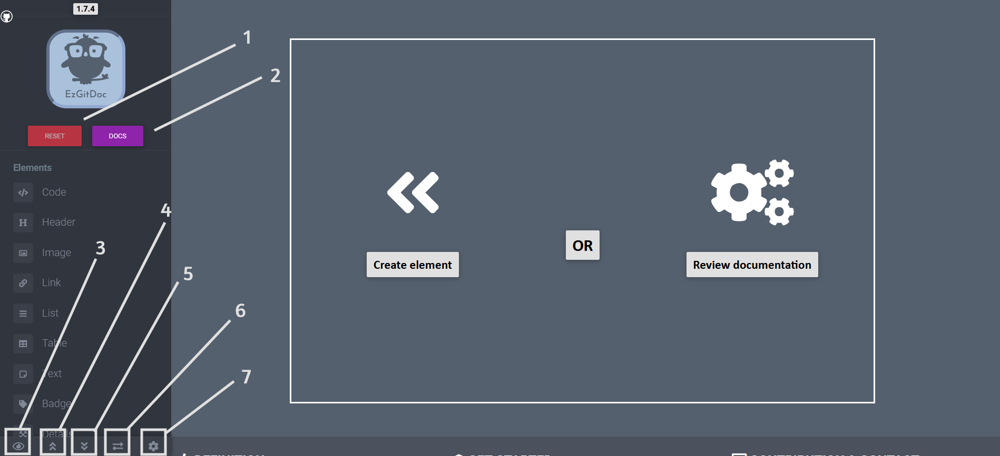
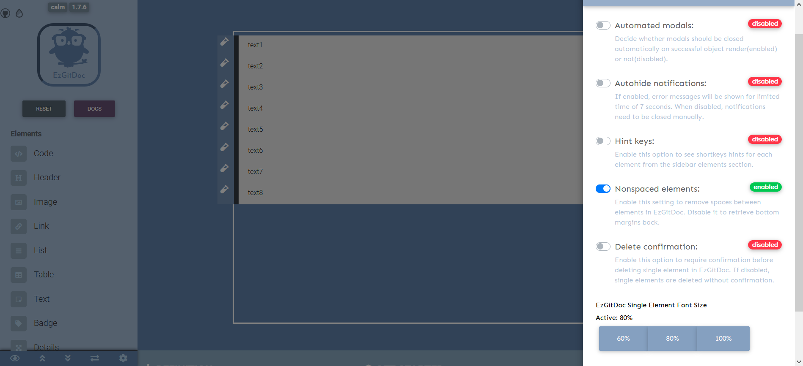
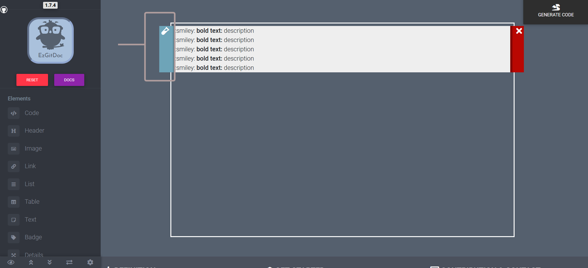

### 1. UI

EzGitDoc interface is split into two sections. Elements that can be created on page are listed in the sidebar on the left. Area with white border is a place where all rendered elements are stored during process of making prototype.

:::note
Clicking one of the elements from sidebar or using exact key combination trigger modal in which you will need to pass some information in order to create element.
:::

### 2. Tools

To reset prototype(clear all created elements) you need to click red button placed below EzGitDoc logo in the sidebar. This operation needs to be confirmed, so don't worry if you click it by mistake. 
  
In the bottom part of the sidebar there are 4 buttons(icons) that perform different operations. First one(eye icon) allows you to close sidebar to preview prototype, double up/down arrow on click slide to the top/bottom of the project. Last one(gear) opens modal with settings that can be adjusted.  

### 3. Settings

### 4. Error Handling

Before elements are created required fields are validated. If given value is incompatible, empty or unexpected, notification will appear in the left top corner with details why element wasn't created. Element won't be created until errors are fixed. 

### 5. Updating content

If you want to fill in data during prototype creation you can do this by clicking left button(with test-tube icon) placed next to the element you wish to update. After that, modal will appear where you will be able to update element contents.

:::tip
If you plan on making more than one change it's worth to use update button oftenly because if you click outside the modal it disappears. Uncommited changes won't be saved and when you toggle update on the same element again, modal will be rerendered from current element state. 
:::

### 6. Swapping & removing elements

If you want to swap elements positions you can do this by clicking with mouse button on the element you wish to move and dragging until reaching desired position.

:::note
To remove certain element, use red button(with white cross icon) that is placed next to it(on the right side).
:::

### 7. Getting output

In order to be able to generate output for *.md file, you need to have at least one element created. If you do, you will notice button in the right top corner of the page. It will generate scheme output on click, showing results in modal like in the example below.

