

Here you will find some examples on how each element is being displayed on EzGitDoc page and how generated code looks in *.md file. Code samples are not included as with EzGitDoc it's very simple to create them. Most are generated in HTML tags but not all(as mentioned in the first case) like list. In the near future I plan to add setting that gives ability to choose between md and html.

### Code

#### EzGitDoc

<blockquote>

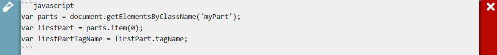

</blockquote>

#### Result

<blockquote>

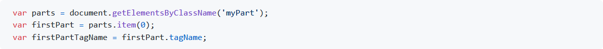

</blockquote>

### Header

#### EzGitDoc

<blockquote>

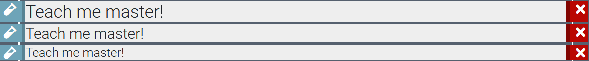

</blockquote>

#### Result

<blockquote>

</blockquote>

EzGitDoc is using HTML &lt;h&gt; tags to create headers in *.md file but it's also possible to use hashtag markdown. HTML tags are 'slightly better' for me due to the fact that they can be used inside other tags like paragraphs while hashtags not. Check the image below. 

<blockquote>

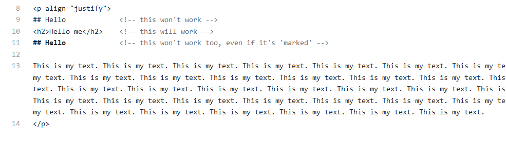

</blockquote>

### Image

#### EzGitDoc

<blockquote>

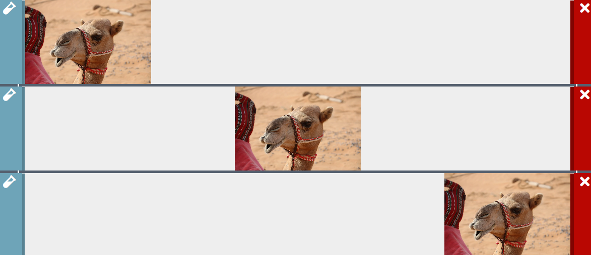

</blockquote>

#### Result

<blockquote>

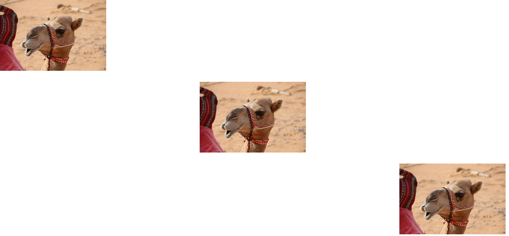

</blockquote>

### Link

#### EzGitDoc

<blockquote>

</blockquote>

#### Result

<blockquote>

</blockquote>

:::note
You can also make hyperlink by using Text element and anchor tag. If you want that single link to be aligned center or right, you can do this using align attribute. 
:::

### List

#### EzGitDoc

<blockquote>

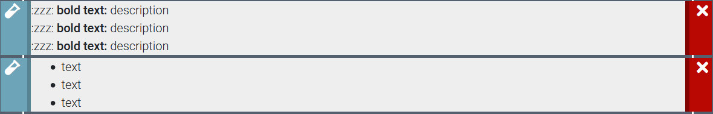

</blockquote>

#### Result

<blockquote>

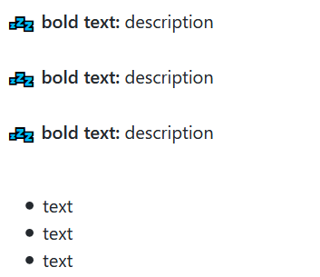

</blockquote>

Example shows two(out of three) types of list that you can create. Typical one with point or custom one(with icon). Third one can be used to for e.g. describe pros in short with icons. Below is old example from EzGitDoc.

<blockquote>

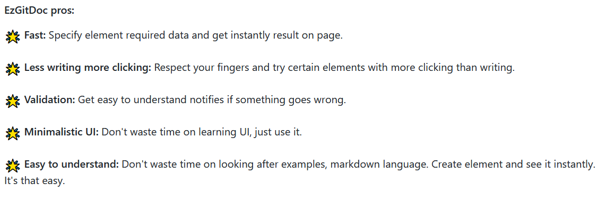

</blockquote>

:::note
By adding extra breakline, you can put description of each advantage below bold title. 
:::

### Table

#### EzGitDoc

<blockquote>

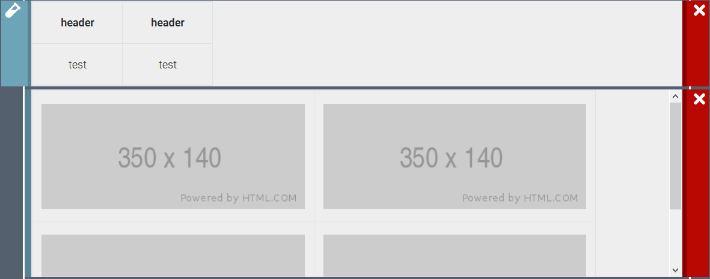

</blockquote>

#### Result

<blockquote>

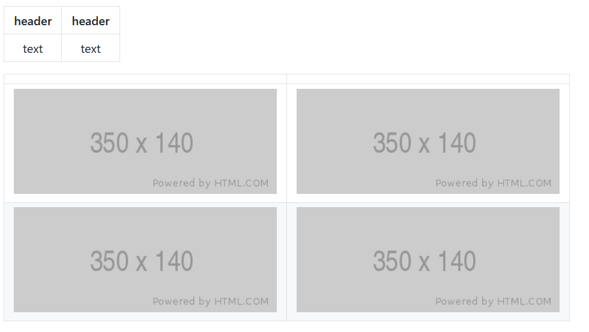

</blockquote>

In the image 2 table types were presented. Typical one with text and second holding images. Sometimes we want to share some screenshots if it's game repository, library or front-end part example etc. I suggest using table to make fancy gallery. If you plan to make one, remember that you need to have same resolution images and then find best width x height composition(or accept unequal rows/image stretches). It costs some time but the effect is very satisfying. Example below from <a href="https://github.com/trolit/projectZero">Project Zero</a> repository:

<blockquote>

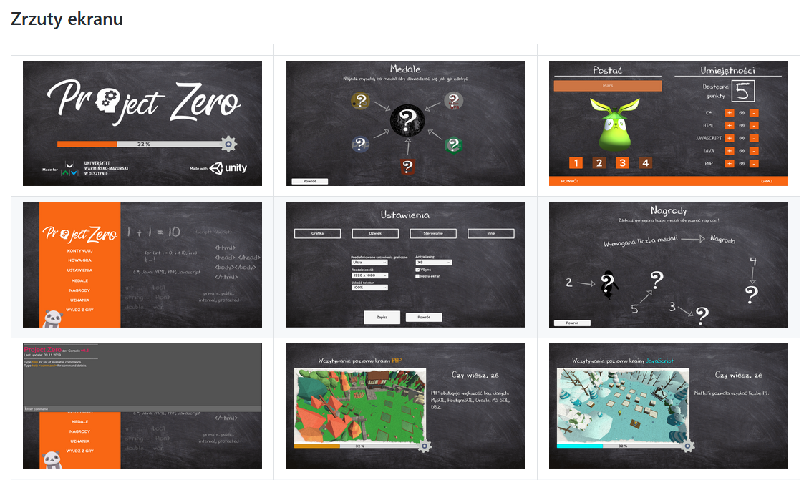

</blockquote>

### Text

#### EzGitDoc

<blockquote>

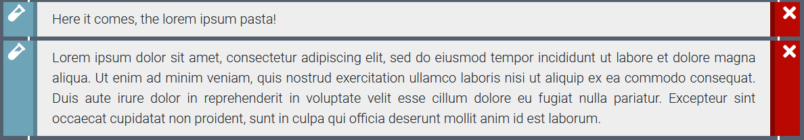

</blockquote>

#### Result

<blockquote>

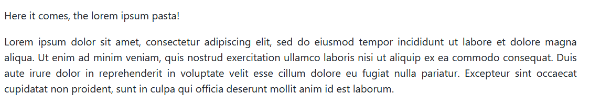

</blockquote>

:::note
Keep in mind that in the text element you can use HTML tags like anchor(a).
:::

### Label

#### EzGitDoc

<blockquote>

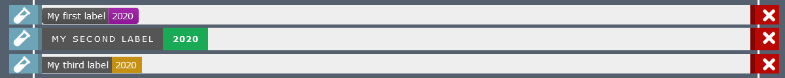

</blockquote>

#### Result

<blockquote>

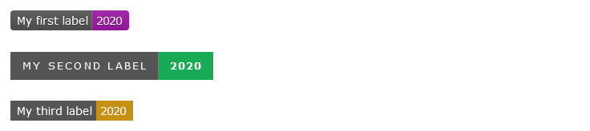

</blockquote>

#### Result (left whitespace between each badge)

<blockquote>

</blockquote>

Labels are great to give short information. EzGitDoc allows to make static badges but you can make dynamic ones by yourself or use predefined. Visit <a href="https://shields.io/">Shields.io</a> to learn more. If you want labels to stay in one line, simply leave just one whitespace between them. 

