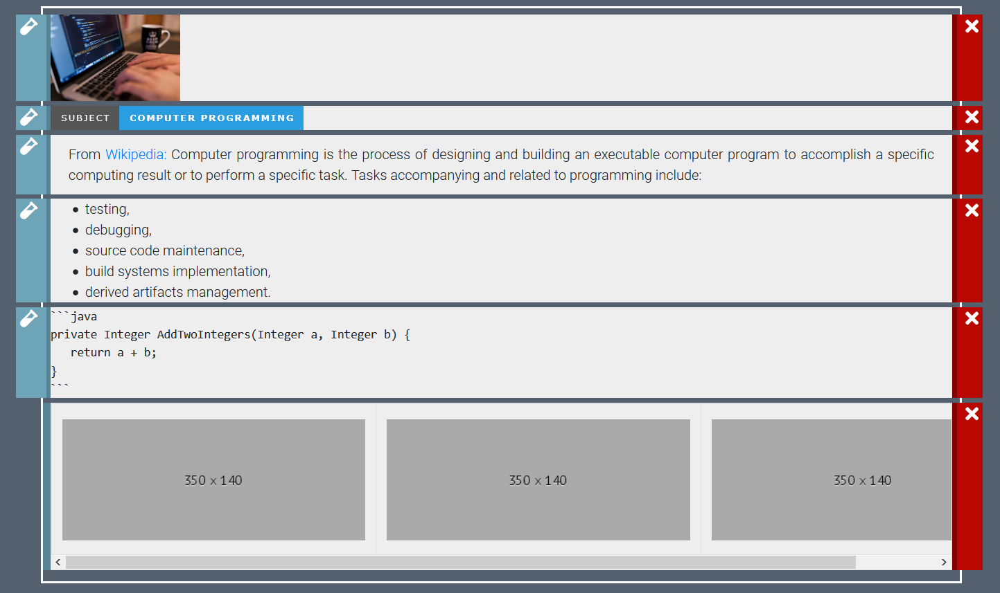

<p align="justify">
With EzGitDoc it's really simple and quick to create document for repository. Below you will find single example on how that process can look like. Used elements: image, badge(<a href="https://shields.io/">Shields.io</a>), text, list, code, table with images.
</p>

### 1. Design prototype



### 2. Get code

````git
<p align="left"></p>


<p align="justify">From <a href="https://en.wikipedia.org/wiki/Computer_programming" draggable="false">Wikipedia:</a> Computer programming is the process of designing and building an executable computer program to accomplish a specific computing result or to perform a specific task. Tasks accompanying and related to programming include: </p>

- testing, 
- debugging,
- source code maintenance,
- build systems implementation,
- derived artifacts management.

```java
private Integer AddTwoIntegers(Integer a, Integer b) {
   return a + b;
}
```

| | | |
| :---: | :---: | :---: |
|  |  |  |
<!-- For image table, it's highly recommended to have the same resolution images. 
 To find best results(no stretches, equal cells), both axis should be adjusted manually. -->

Template generated using <a href="https://github.com/trolit/EzGitDoc">EzGitDoc</a>

````

### 3. Preview outcome

<code>
<p align="left"></p>


<p align="justify">From <a href="https://en.wikipedia.org/wiki/Computer_programming" draggable="false">Wikipedia:</a> Computer programming is the process of designing and building an executable computer program to accomplish a specific computing result or to perform a specific task. Tasks accompanying and related to programming include: </p>

- testing, 
- debugging,
- source code maintenance,
- build systems implementation,
- derived artifacts management.

```java
private Integer AddTwoIntegers(Integer a, Integer b) {
   return a + b;
}
```

| | | |
| :---: | :---: | :---: |
|  |  |  |
<!-- For image table, it's highly recommended to have the same resolution images. 
 To find best results(no stretches, equal cells), both axis should be adjusted manually. -->

Template generated using <a href="https://github.com/trolit/EzGitDoc">EzGitDoc</a>
</code>

### 4. Adjust outcome & commit :)

```
Changes:
- increased banner image size 
- removed subject part from label
- fixed function name
- filled in images in table (didn't have to change default 340x140 scaling as they fit)
```

<code>
<p align="left"></p>


<p align="justify">From <a href="https://en.wikipedia.org/wiki/Computer_programming" draggable="false">Wikipedia:</a> Computer programming is the process of designing and building an executable computer program to accomplish a specific computing result or to perform a specific task. Tasks accompanying and related to programming include: </p>

- testing, 
- debugging,
- source code maintenance,
- build systems implementation,
- derived artifacts management.

```java
private Integer addTwoIntegers(Integer a, Integer b) {
   return a + b;
}
```

| | | |
| :---: | :---: | :---: |
|  |  |  |
<!-- For image table, it's highly recommended to have the same resolution images. 
 To find best results(no stretches, equal cells), both axis should be adjusted manually. -->

Template generated using <a href="https://github.com/trolit/EzGitDoc">EzGitDoc</a>
</code>